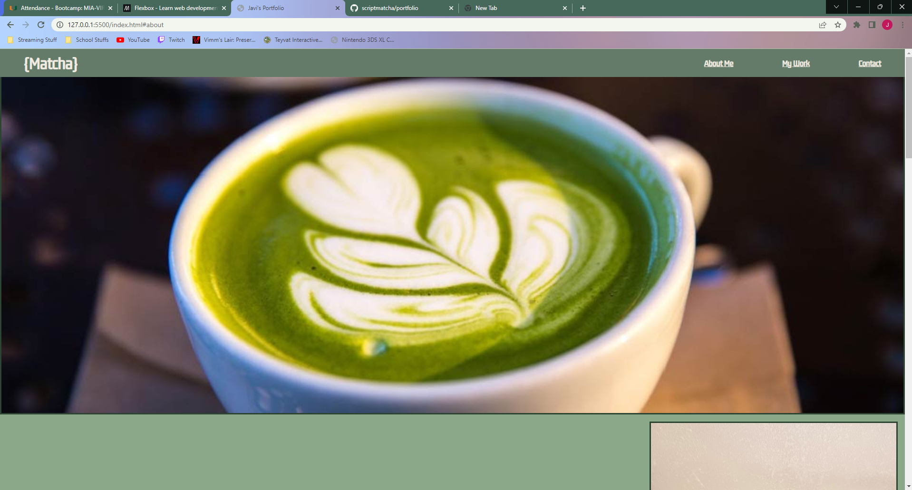

# UM Coding Bootcamp Module 2 Challenge

## Create a portfolio webpage from scratch

## User Story

```
AS AN employer
I WANT to view a potential employee's deployed portfolio of work samples
SO THAT I can review samples of their work and assess whether they're a good candidate for an open position
```


## Acceptance Criteria

Here are the critical requirements necessary to develop a portfolio that satisfies a typical hiring manager’s needs:

```
GIVEN I need to sample a potential employee's previous work
WHEN I load their portfolio
THEN I am presented with the developer's name, a recent photo or avatar, and links to sections about them, their work, and how to contact them
WHEN I click one of the links in the navigation
THEN the UI scrolls to the corresponding section
WHEN I click on the link to the section about their work
THEN the UI scrolls to a section with titled images of the developer's applications
WHEN I am presented with the developer's first application
THEN that application's image should be larger in size than the others
WHEN I click on the images of the applications
THEN I am taken to that deployed application
WHEN I resize the page or view the site on various screens and devices
THEN I am presented with a responsive layout that adapts to my viewport
```

## Usage

At the top of the screen you will find 3 nav links. They will each take you to their respected section on the webpage.
When you reach the 'My Work' section of the page you can click on one of the projects shown to be taken to the deploued webpage.
At the bottom of the page you will find the 'Contact Me' section, containing three links. Clicking on them will take you to my profile on that particular website (twitter, github, or will set you up to email me).

## Screenshot



## Deployed Page

The webpage has been deployed at: https://scriptmatcha.github.io/portfolio/
